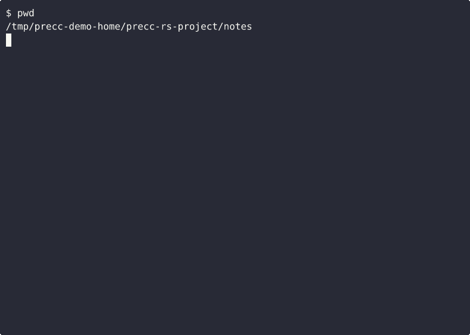

# precc

[](https://github.com/precc-cli/precc/actions/workflows/ci.yml)
[](#license)
[](https://github.com/rtk-ai/rtk)

**Predictive error correction for LLM-driven shells.**



`precc` is a `PreToolUse:Bash` hook for Claude Code (and similar agentic
shells) that rewrites commands *before* they run, turning what would have
been a failed turn into a successful one. It is the missing input-shaping
layer that sits next to output-compressing tools.

## What it does

Four pillars, one hook:

1. **Context resolution** — `cargo build` outside a Rust project? `precc`
   prepends the right `cd`.
2. **GDB opportunities** — repeated failures on the same command get a
   one-line diagnostic hint.
3. **Pattern mining** — failure → fix pairs in your shell history are
   distilled into preventions for next time.
4. **Skills** — high-confidence patterns auto-apply: `git status` in a
   `jj`-colocated repo becomes `jj status`; `asciinema rec` becomes
   `precc gif`; …

Optional fifth: pluggable **output compressors** (e.g. [`rtk`](https://github.com/rtk-ai/rtk)) — opt-in
via `~/.config/precc/config.toml`.

## Status

`v0.1` — early release. The hook, skills system, and metrics are
operational; the compressor layer ships with two adapters (`none`,
`rtk`) and is extensible.

## Install

```bash
cargo install precc-cli
cargo install precc-hook            # Claude Code
cargo install precc-cursor-hook     # Cursor (optional)
cargo install precc-shell           # Aider (optional)
precc init
```

Then add to your Claude Code `settings.json`:

```jsonc
{
  "hooks": {
    "PreToolUse": [
      { "matcher": "Bash", "hooks": [{ "type": "command", "command": "precc-hook" }] }
    ]
  }
}
```

## Other tools

PRECC also ships first-class shims for two more agentic-coding tools:

### Cursor

Cursor exposes a `beforeShellExecution` hook. Install `precc-cursor-hook`
and drop [`examples/cursor/hooks.json`](examples/cursor/hooks.json) at
`~/.cursor/hooks.json`. Note: Cursor's hook protocol is allow/deny only
(no rewrite field), so PRECC denies wrong-dir commands and surfaces the
corrected invocation via `agent_message`. The agent re-runs the
suggested command on the next turn.

### Aider

Aider has no hook surface. PRECC ships [`precc-shell`](crates/precc-shell),
a thin `$SHELL` wrapper. Install it and set `SHELL=$(which precc-shell)`;
Aider's `/run` invocations now flow through PRECC. See
[`examples/aider/`](examples/aider/) for details.

## Acknowledgments

PRECC stands on excellent open tools — it's the predictive/agent layer, not a
from-scratch reinvention:

- **[RTK](https://github.com/rtk-ai/rtk)** — the command-output compression
  engine behind PRECC's `rtk` compressor. When the compressor is enabled, PRECC
  rewrites recognized commands to run through RTK so coding agents see compact
  output and burn less context. The rewriting is RTK's; PRECC decides *when* to
  apply it.
- The Rust ecosystem — `rusqlite`, `regex`, `serde`, `clap`, and friends.

PRECC integrates these as optional, pluggable backends; credit for the
compression work belongs upstream.

## License

Dual-licensed under MIT or Apache-2.0, at your option.
